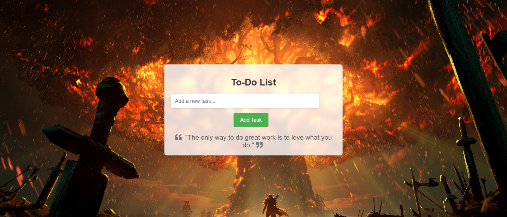

# To-Do-List

A simple web-based To-Do List application built using HTML, CSS, and JavaScript.

## Features

- Add new tasks to the to-do list.
- Mark tasks as completed.
- Delete tasks.
- Save tasks in the browser's local storage.

## Usage
- Add a new task:
Type your task in the input field and press Enter or click the "Add" button.
-Mark a task as completed:
Click on the checkbox next to the task to mark it as completed.
-Delete a task:
Click on the "Delete" button next to the task to remove it from the list.
-Local Storage:
Your to-do list tasks are stored in the browser's local storage, so they will persist even if you close the browser.

##Screenshot

